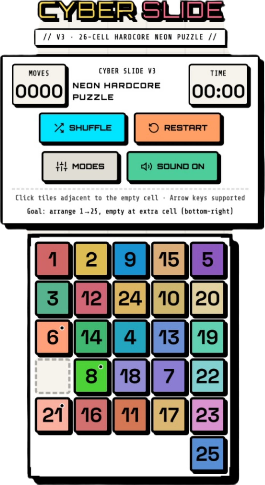

<div align="center">

# ⚡ CYBER SLIDE

**A high-fidelity, neon-brutalist sliding puzzle game built with React 19 + Vite 7 + Tailwind CSS v4 + TypeScript.**

[](https://cyber-slide.pages.dev)
[](LICENCE)
[](https://react.dev)
[](https://vitejs.dev)
[](https://tailwindcss.com)

<br />



</div>

---

## 🎮 Overview

**CyberSlide (V3)** is a classic sliding puzzle wrapped in a striking cyberpunk neon aesthetic. Unlike standard sliding puzzles, CyberSlide features an **irregular 26-cell layout** that adds a layer of pathfinding complexity. Slide, plan, and optimize your path under neon scanlines and customizable hardcore rules.

* **The Grid:** A $5 \times 5$ square (25 cells) augmented with an **extra 26th cell** connected exclusively to the bottom-right corner (Cell 24).
* **The Goal:** Arrange numbers **1 to 25** in sequential order, leaving the extra 26th cell empty.
* **The Challenge:** Complete the puzzle quickly, using the fewest moves possible, while navigating active hardcore modifiers.

---

## ⚡ Hardcore Modifiers

Take the challenge to the next level by combining any of the five toggleable modifiers. Enabling or disabling any mode dynamically recalculates pathing rules and triggers an immediate, solvable board reshuffle.

| Modifier | State Variable | Visual Indicator | Gameplay Mechanics & Rule Alteration |
| :--- | :--- | :--- | :--- |
| **Move Limit** | `moveLimit` | 🟡 `#ffd166` | Cap at **200 moves max**. A live counter displays remaining moves, flashing red when $\le 30$. Exceeding the limit triggers a **Game Over**. |
| **Timer** | `timer` | 🔴 `#f72585` | A **180-second countdown** begins on your first move. Danger state flashes when $\le 30$ seconds remain. Running out of time triggers a **Game Over**. |
| **Obstacles** | `obstacles` | 🍎 `#ff6b6b` | **Cell 12 (center cell of the grid)** becomes a blocked node. No tile can reside in, enter, or pass through Cell 12. |
| **Locked Tile** | `lockedTiles` | 🟣 `#a044ff` | **Tile 5 is permanently locked** to its current cell. It cannot slide into the empty space, altering the pathing topology. |
| **Hardcore Shuffle**| `hardcoreShuffle`| 🟠 `#f95738` | Generates a complex, highly randomized puzzle using **300 random-walk steps** instead of the standard 150. |

---

## 🏆 Rating & Scoring System

Your performance is graded dynamically upon solve completion using a star-rating matrix based on execution speed and efficiency:

* ⭐⭐⭐ **LEGENDARY**: Solved in $\le 60$ moves **AND** $\le 90$ seconds.
* ⭐⭐ **ELITE**: Solved in $\le 120$ moves **AND** $\le 180$ seconds.
* ⭐ **HACKER**: Default ranking for all other successful solves.

> [!NOTE]
> Active hardcore modes are factored into the rating display, and you can share your achievement directly to **X (formerly Twitter)** with a single click using our integrated sharing system!

---

## 🎨 Aesthetic & Engine Features

* **Procedural Sound Engine**: Powered by the native **Web Audio API**—no external audio files, requests, or delay. Short square-wave clicks trigger on moves, low sawtooth buzzes on errors, rapid sweeps on shuffles, and an ascending sine-wave arpeggio on victory.
* **Neo-Brutalist Cyberpunk UI**: Flat drop-shadows, thick high-contrast borders, neon glows, and custom typography.
* **Animations**: Pure CSS scanline overlays, moving background grid-lines, ambient glows, and a physical translation glide animation using the Element animate API to render fluid tile sliding.
* **Keyboard Navigation**: Play seamlessly with your keyboard. Arrow keys automatically slide adjacent tiles into the empty slot:
  * `ArrowUp` ➡️ Slide tile from **below** into empty space.
  * `ArrowDown` ➡️ Slide tile from **above** into empty space.
  * `ArrowLeft` ➡️ Slide tile from **right** into empty space.
  * `ArrowRight` ➡️ Slide tile from **left** into empty space.
* **Single-File Bundling**: Optimized with `vite-plugin-singlefile` to package all HTML, scripts, CSS, and assets into a single, self-contained `index.html` file in `dist/`.

---

## 📂 Project Structure

```
Cyber-Slide/
├── assets/                 # Brand assets & images (e.g. cyberslide.png)
├── dist/                   # Production build outputs (compiled single-file bundle)
├── public/                 # Static public assets
│   ├── _headers            # Security and CORS response headers for CDN delivery
│   └── _redirects          # SPA routing fallback for static hosts
├── src/
│   ├── components/
│   │   ├── Board.tsx        # Grid renderer, obstacle states, and game overlays (won/lost)
│   │   ├── HUD.tsx          # Real-time moves, countdown timer, sound control, and reset buttons
│   │   ├── ModePanel.tsx    # Interactive neon control board for setting hardcore modifiers
│   │   ├── Tile.tsx         # Renders individual cells with translation animation and obstacle overlays
│   │   └── WinModal.tsx     # Victory popup showing star rating, score details, and share-on-X link
│   ├── game/
│   │   ├── graph.ts         # Build adjacency matrix for 26 cells & implements mode-aware path filters
│   │   ├── modes.ts         # Hardcore mode types, default configurations, and neon colors
│   │   ├── puzzleLogic.ts   # Core game mechanics: moves applier, solvable shuffler, and win check
│   │   └── sounds.ts        # Synthesizes sound effects procedurally via Web Audio API oscillators
│   ├── hooks/
│   │   └── useGameState.ts  # Game state hook orchestrating timer, keyboard events, and rule toggles
│   ├── styles/
│   │   └── game.css         # Main stylesheet containing cyberpunk grid lines, scanlines, and layouts
│   ├── utils/
│   │   ├── cn.ts            # ClassName merging helper (combining clsx + tailwind-merge)
│   │   └── tileColors.ts    # Custom map assigning unique, harmonic neon gradients to all 25 tiles
│   ├── App.tsx              # Application container, background grids, overlays, and layout frame
│   ├── index.css            # Base stylesheet reset
│   └── main.tsx             # React rendering entrypoint
├── index.html               # Main page layout loading google fonts (VT323, Orbitron, Share Tech Mono)
├── package.json             # Build configurations, Vite 7 plugins, and React 19 dependencies
├── tsconfig.json            # Strict TypeScript configuration
└── vite.config.ts           # Bundler configuration incorporating Vite, React, Tailwind, and SingleFile
```

---

## 🚀 Getting Started

### Prerequisites

* **Node.js**: Version 18.0.0 or higher
* **npm**: Version 9.0.0 or higher

### Local Setup

```bash
# 1. Clone the repository
git clone https://github.com/ClashLex/Cyber-Slide.git
cd Cyber-Slide

# 2. Install dependencies
npm install

# 3. Start development server
npm run dev
```

Open your browser and navigate to `http://localhost:5173` (or the URL provided in the console).

### Production Build & Bundling

Build the project into a single-file, production-ready bundle located in `dist/index.html`:

```bash
npm run build
```

You can preview the production bundle locally with:

```bash
npm run preview
```

### Static Hosting Deployments

#### GitHub Pages
To deploy directly to GitHub Pages, configure your homepage in `package.json` and execute:
```bash
npm run deploy
```

#### Cloudflare Pages & Vercel
Deploying the production bundle is simple:
1. Link your repository.
2. Set the build command to `npm run build`.
3. Set the output directory to `dist`.
*Static header controls (`_headers`) and SPA redirects (`_redirects`) will be copied automatically during the build.*

---

## 🗺️ Roadmap

- [ ] **Leaderboard Engine**: Integrate a serverless database to track and show high scores globally.
- [ ] **Retro Theme Customizer**: Allow toggling between Cyberpunk, Vaporwave, and Matrix aesthetic profiles.
- [ ] **Variable Grid Dimensions**: Introduce $3 \times 3$, $4 \times 4$, and $6 \times 6$ irregular grid variants.
- [ ] **Mobile Swipe Gestures**: Enhance mobile gameplay with touch-based swiping.
- [ ] **AI-Powered Solver**: Integrated BFS/A* visual solver to demonstrate the optimal path.
- [ ] **Background Soundscapes**: Add low-frequency procedural synthesizer background loops.

---

## 🤝 Contributing

Contributions are welcome! Please feel free to open issues or submit pull requests.

1. Fork the Project.
2. Create your Feature Branch (`git checkout -b feature/AmazingFeature`).
3. Commit your Changes (`git commit -m 'Add some AmazingFeature'`).
4. Push to the Branch (`git push origin feature/AmazingFeature`).
5. Open a Pull Request.

---

## 📜 License

Distributed under the MIT License. See [LICENCE](LICENCE) for more information.

<div align="center">

Built with ⚡termux and Antigravity &nbsp;·&nbsp; by [ClashLex](https://github.com/ClashLex)

</div>
